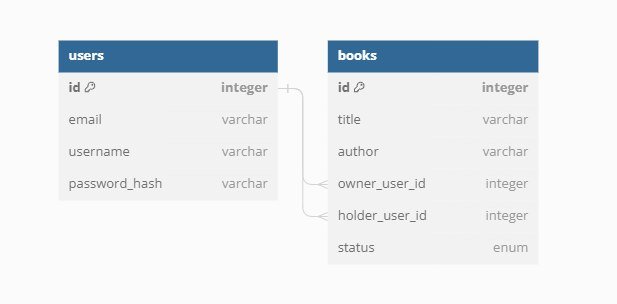

# BookSharing

## Database

  

## Auth
void login (string email, string password)  
void register (string email, string password)  
void delete_account ()  
void logout ()  
void change_password (string password)  

## Interfaces
void addBook (<all of the book properties (books table in database)>)  
void modifyBook (<all of the book properties>)  
void deleteBook (int book_id)  
List\<book> searchByTitle (string title)  
List\<book> searchByUser (int user_id)  
List\<book> searchByAuthor (string author)  
(all searches will probably be done in one method, to every one also boolean only_available could be added)   
void borrowBook (int book_id, int new_holder_user_id)  
void returnBookToOwner (int book_id)  

## Android Classes
1. ViewClasses -> back-end classes for every view in application to handle events like clicking button, etc.  
2. HttpsService -> Class that handles https requests and responses  
3. HttpsRequests -> Class with requests to DB server, GET's, POST's  
4. HttpsAuthorisation -> Also requests to server, but different class to separate security stuff  
5. BookEntity -> Java class that is representation of Book in DB  

## Database Classes
1. BookRepository
2. BookController
3. BookEntity
4. AuthRepository
5. AuthController
6. UserEntity

## iPhone
TBD